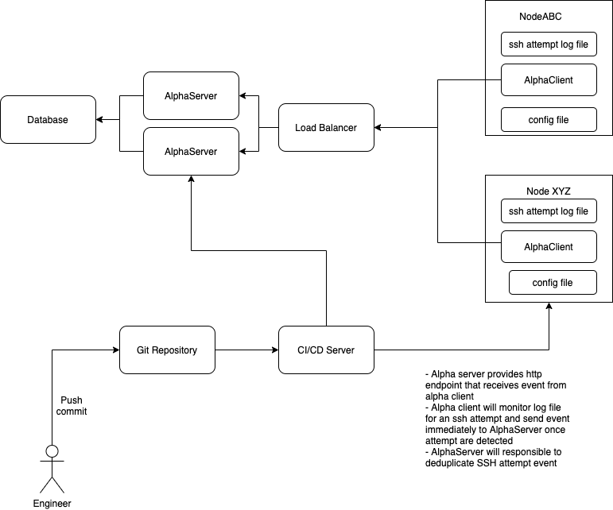

# Alpha Log Systems

Alpha log system consists of two components. They are AlphaClient and AlphaServer.
AlphaClient monitors ssh log files and send the event to AlphaServer.
AlphaServer receives events from AlphaClient and displays number of ssh attempt based on event from AlphaClient.

## System Architecture

Here is system architecture for the solution 

Some of notable implementations decisions:
- AlphaClient sends raw SSH attempt event to AlphaServer. AlphaClient using HTTP POST with basic token authentication for simplicity of implementation.
- AlphaServer responsible for deduplication of event since the limited functionality provided by library that's available to monitor SSH attempt log file.
- AlphaServer stores SSH attempt event to Postgres database for simplicity on the implementor side.
- AlphaServer queries databases to calculate SSH attempt for each hosts and display attempt metrics on a simple static web page for simplicity of implementation.

## Build

Run `make build` to build alpha-client and alpha-server. Binary for `alpha-client` and `alpha-server` are available under the `bin` directory.
To create binary for multiple platform, run `make compile`.
All generated binaries are stored under the `bin` directory.

 ## Run

Here is step by step guide to run all components of the system in your local machine.
You need to have Docker Engine and Docker Compose installed.
1. Run Postgres database, `docker-compose up -d`
1. Run alpha-server, `make run-alpha-server`
1. Open a new terminal and run alpha-client, `make run-alpha-client`

## Deployment

Here is step by step guide to deploy alpha-server into Linux servers.
It's assumed that Postgres database has already been prepared and ready to be used by AlphaServer.
The machine where deployment executed must has SSH connection configured to all the AlphaServer and AlphaClient target servers.
Deployment step is implemented using Ansible.

Here is the steps to deploy AlphaServer:

1. Open terminal, clone this repository, and change working directory into the repository root directory.
1. Add AlphaServers address and SSH username that will be used to deploy AlphaServer under the `[alpha-servers]` section on the `hosts` file.
1. Initiate deployment of AlphaServer, `cd infra; ./deploy-alpha-server.sh <ALPHA_SERVER_TOKEN> <DB_PASSWORD>`.
   The first parameter for the `deploy-alpha-server.sh` is authentication that will be used by AlphaServer to verify token authentication when receiving event from AlphaClient.
   The second parameter is password to connect to database.
   Both of these values are sensitive so they shouldn't be committed in plaintext in a git repository.
   Another alternative to handle sensitive value in Ansible is to encypt them using `ansible-vault` so the encrypted file can be committed to a git repository.
   The second alternative is to use lookup plugin.
   You can see available plugins on [https://docs.ansible.com/ansible/2.5/plugins/lookup.html#plugin-list](https://docs.ansible.com/ansible/2.5/plugins/lookup.html#plugin-list)

Follow these steps to deploy AlphaClient:

1. Open terminal, clone this repository, and change working directory into the repository root directory.
1. Add AlphaClient address and SSH username that will be used to deploy AlphaClient under the `[alpha-clients]` section on the `hosts` file.
1. Initiate deployment of AlphaClient, `cd infra; ./deploy-alpha-server.sh <ALPHA_SERVER_TOKEN>`.
   The first parameter for the `deploy-alpha-server.sh` is token that will be used by AlphaClient to authenticate when sending SSH login attempt to AlphaServer.
   The value must be matching with the token used by AlphaServer.
   This is a sensitive value that shouldn't be stored in plain text in a git repository.

## Future Implementation Ideas

- Create build and deploy pipelines using common CI/CD platforms such as Jenkins, Github Action, or Gitlab CD.
- Package AlphaServer and AlphaClient as a linux container image and made it available in a container registry. This will make AlphaServer more accessible to be deployed in containerized env such as Kubernetes.
- Handle AlphaServer infrastructure provisioning using IaC tool such as Terraform.
  Infrastructure component includes Postgres cluster, machines for AlphaServer, load balancer, domain name, and HTTPS certificate.
  Result of the infrastructure provisioning can be used to fill in value in the `hosts` file.
- Implement remote secret management such as Hashicorp Vault, AWS Secret Manager, or using chamber with Parameter Store as backend.
- Implement autoscaling for AlphaServer. We'll need to invert the deployment flow from push to pull mode to support autoscaling.
  Alternatively, we can create new OS image with binary and config preconfigured and ready to run.
  We then use this image on the autoscaling configuration.
  The tradeoff is it will take time to build the OS image but startup time will be faster since everything has been preconfigured.
